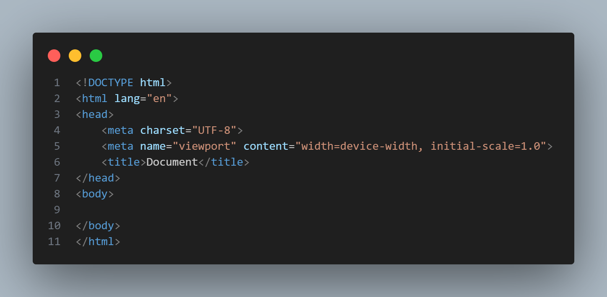

# Explicação do HTML

<!-- Este é um exemplo simples de um documento HTML explicando cada linha de código -->

- `<DOCTYPE html>`: Declara o tipo de documento HTML que está sendo utilizado, neste caso, HTML5.
- `<html lang="en">`: Define o início do documento HTML, especificando o idioma como inglês (en).
- para dizer que o documento será em português brasileiro substitua o en por pt-br. 
- `<head>`: Contém informações sobre o documento, como metadados, scripts, estilos e o título da página.
- `<meta charset="UTF-8">`: Define a codificação de caracteres do documento como UTF-8, que suporta uma ampla gama de caracteres.
- `<meta name="viewport" content="width=device-width, initial-scale=1.0">`: Define as configurações de visualização para dispositivos móveis, garantindo que a largura da página seja igual à largura do dispositivo e que a escala inicial seja 1.0.
- `<title>Document</title>`: Define o título da página que é exibido na barra de título do navegador.
- `<body>`: Contém todo o conteúdo visível da página, como texto, imagens, links, etc.
